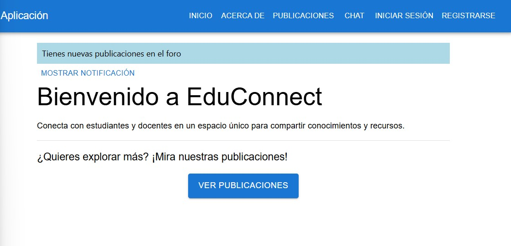
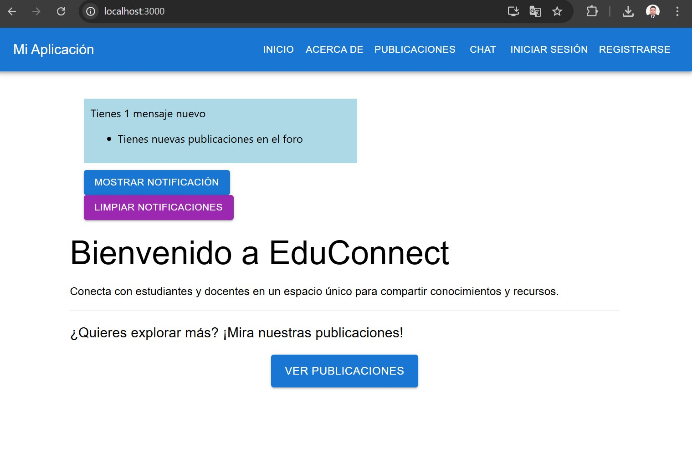
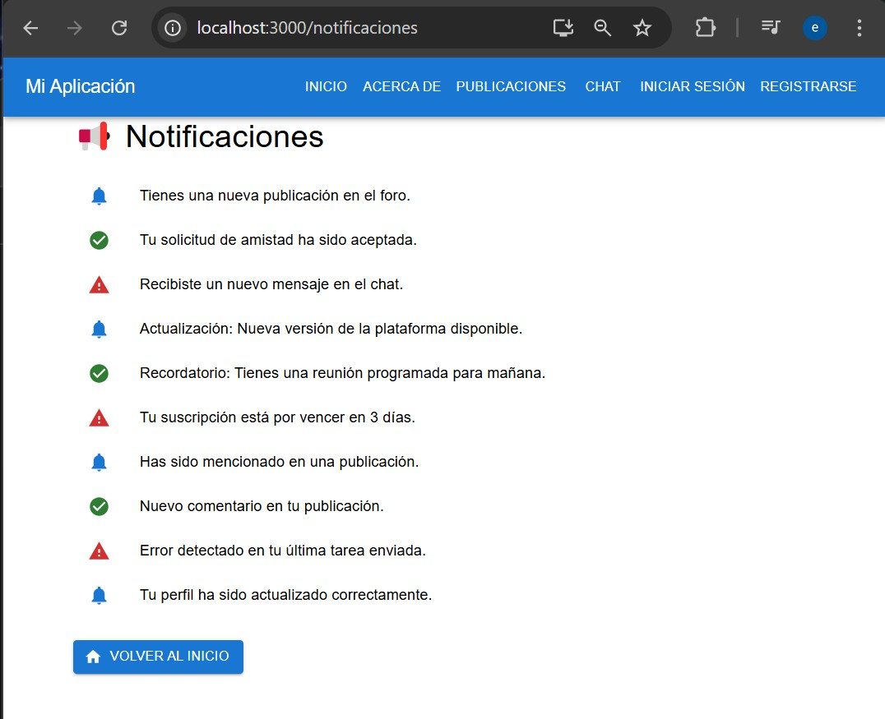
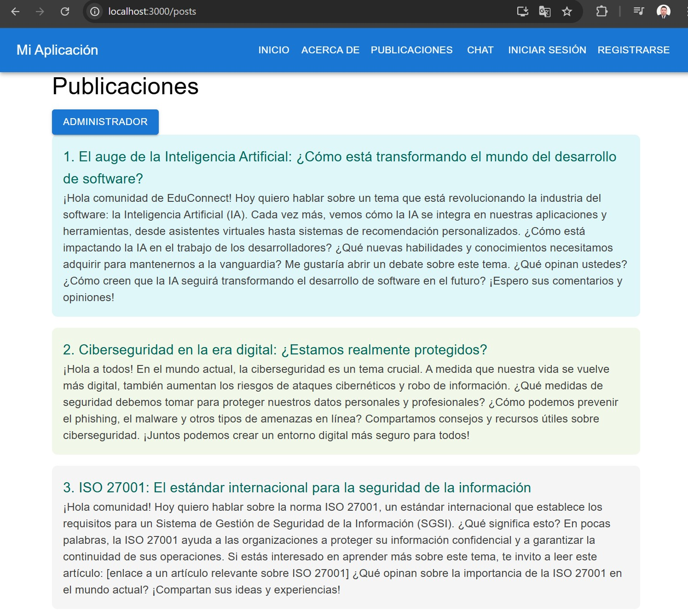
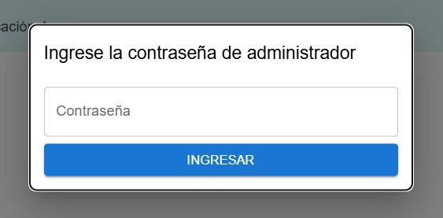
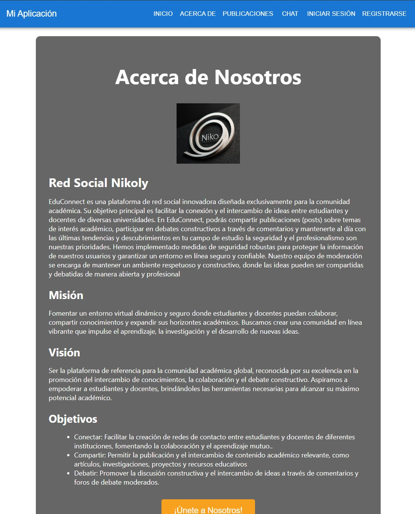
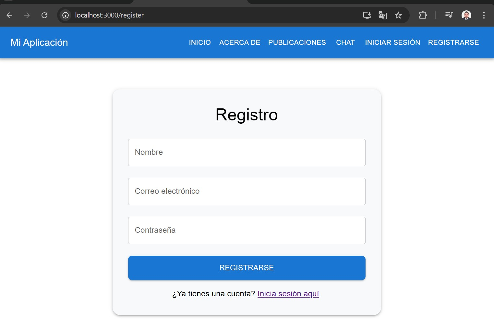
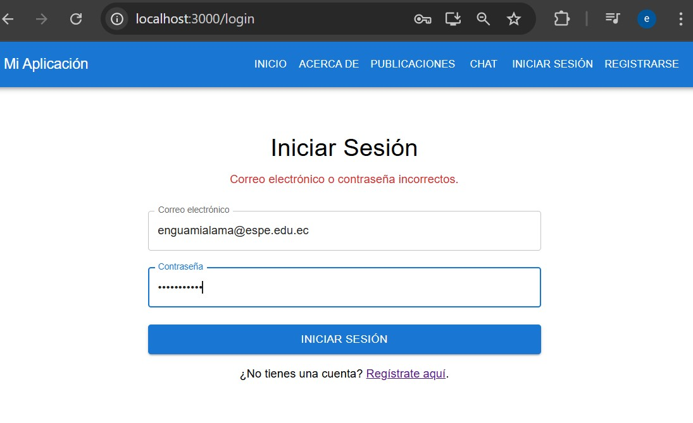
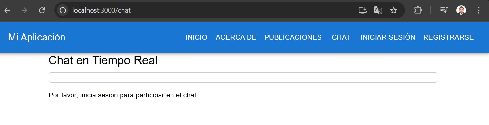
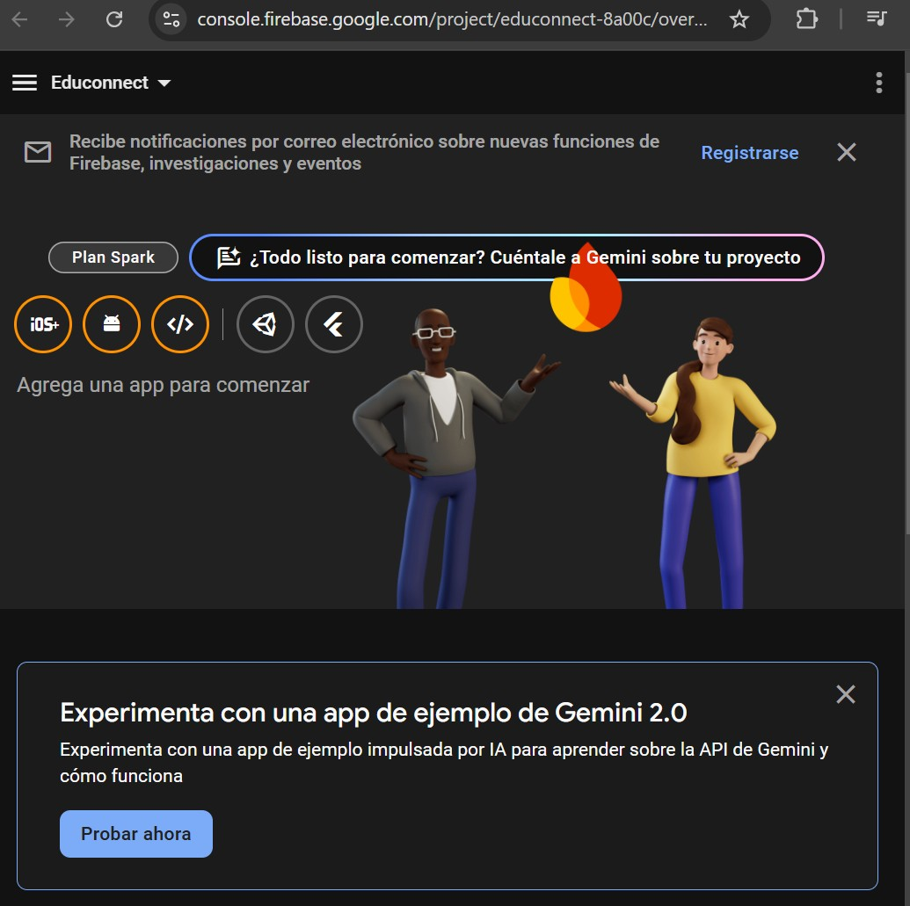

# ESPE

## Estudiante 
### Edison Nicolas Guamialama Haro 

## Docente 
### Ing. Angel Codco


## Actividad de aprendizaje n.° 2

# EduConnect

EduConnect es una aplicación web desarrollada con **React** y **TypeScript** que permite gestionar la educación de manera eficiente, proporcionando herramientas para estudiantes, profesores y administradores.  

## 📌 Características

- Gestión de usuarios (estudiantes, profesores, administradores).  
- Interfaz moderna y accesible.  
- Soporte para formularios y validación de datos.  
- Implementación de buenas prácticas con TypeScript.  

## 📋 Requisitos Previos

Antes de instalar el proyecto, nos asegúramos de tener los siguientes requisitos en nuestro sistema:  

- [Node.js](https://nodejs.org/) (versión 16 o superior)  
- [npm](https://www.npmjs.com/) o [yarn](https://yarnpkg.com/)  
- Un editor de código como [VS Code](https://code.visualstudio.com/)  

## 🔧 Instalación

Sigue estos pasos para configurar y ejecutar el proyecto en tu máquina local:

1. **Clona el repositorio:**  

   ```sh
   git clone https://github.com/ENiko-Gh/-educonnect.git
   cd educonnect
Instala las dependencias:

npm install
Inicia el servidor de desarrollo:

npm start
Accede a la aplicación:

Abre tu navegador en http://localhost:3000

🚀 Construcción y Despliegue
Para generar una versión optimizada del proyecto, ejecutamos:

npm run build
Esto generará una carpeta build/ lista para producción.

❓ Solución de Problemas
Si tienes problemas con dependencias o paquetes, intenta los siguientes comandos:

rm -rf node_modules package-lock.json
npm install
Si el problema persiste, revisa la documentación oficial de React y TypeScript.

🛠 Tecnologías Utilizadas
React 19.0
TypeScript 5.7
React Router para navegación
CSS Modules / Tailwind CSS para estilos


### DESARROLLO  Y VISUALIZACION DEL PROYECTO "EDUCONNECT"


luego del detalle de la instalacion  prosedemos a implementar las carpetas  en funcion de una estructura  previamente analizada

al inicio empeso de esta manera  el desarrollo de la actividad 


Esta apliccion cuenta en el header con un menu de navegacion consta de inicio , Acerca de, Publicaciones, Chat, iniciar secion
registrarce 

en la pagina de inicio


contiene un sistema da notificacion  que cuando existe alguna noticiacin  externa o intenrna al sistema 
se visualiza  (Iienes un nuevo mensaje ) en el mismo espacio de visualizacion  se visualiza el mensaje de 
publicaciones realizada  dispone de un enlace a las notificaciones   y otro  que podemos Eliminar   o limpiar las notificaciones 




mensaje de bienveida  con una pequeña descripcion y la invitacion a formar parte de nuestro sistema 
al dar click en "VER PUBLICACIONES" redirige a las publicaciones  

```tsx
 const handleNotificationClick = () => {
        const nuevosMensajes = [
            'Nuevo comentario en tu publicación',
            'Un usuario respondió tu mensaje',
            'Tienes una nueva solicitud de amistad'
        ];
        const mensajeAleatorio = nuevosMensajes[Math.floor(Math.random() * nuevosMensajes.length)];
        setNotifications((prev) => [...prev, mensajeAleatorio]);

        // Redirige a la página de notificaciones
        navigate('/notificaciones')
    };
```


mensaje de bienveida  con una pequeña descripcion y la invitacion a formar parte de nuestro sistema 
al dar click en "VER PUBLICACIONES" redirige a las publicaciones  



vemos que existe tres publicaciones   esta  publicaciones el administrados  previa a una clave 



ingresada la  clave " Admin123"  se  redirige a un Modal de el formualrio conde el administrador puede  editar o eliminar estos mensajes e para evitas que los mensajes sean ofencivos o no esten acordes a las politicaas del foro


desde est fromulario tambien puede el administrador realizar publicaciones es para mas poner tematica para debate o foros 

Pagina de Acerca de nosotros 

es donde mas se destaca el ser de la pagina y su objetico 



en la parte inferior al dar click en el boton de !uneta a Nosotros!  le redirige a la pagina de publicaciones y posterior ala paguina de Registrarce 
en la pagina de registrarte existe un formulario donde solcitara  campos obligatorios  



este formulario si no es los campos completos no le deja abansar observando una notificacion al dar click en registrarse estos datos se almacenas el el localstorage  y se redirige  a la paguina de inicio de secion aqui se verifica  que el nuevo usaurio est registrado al momento de poner alguna contrasenia o usuaro erroneo le nitifica 




al ingresar las credenciales correctas  de abre el formulario de publicaciones  donde se puede publicar nuevos articulos 

el plus de esta pagina es el chat en en tiempo real 
esta pagina es con conexion externa para interactuar con estudiantes de la misma univesidad y otras univesidades esta sela realizo con una plataforma externa me detendre un poco mas para explicar


Para evitar que los publicadores accedan a secciones de admin, se crea un componente de protección en ProtectedRoute.tsx

```tsx
import { Navigate } from 'react-router-dom';

const ProtectedRoute = ({ user, role, requiredRole, children }: { user: any, role: string | null, requiredRole: string, children: JSX.Element }) => {
    if (!user || role !== requiredRole) {
        return <Navigate to="/" />;
    }
    return children;
};

```

Usamos initializeApp(firebaseConfig) para inicializar Firebase 
Se utilizó DocumentData de Firestore para manejar los datos de los mensajes
Optimización de Dependencias en useEffect
Funciona con Firebase 9+ (nuevo SDK modular)
En el archivo Register.tsx, al registrar un usuario, guardaremos su rol en Firestore:

``` tsx
import { auth, db } from '../utils/firebase';
import { createUserWithEmailAndPassword } from 'firebase/auth';
import { doc, setDoc } from 'firebase/firestore';

const registerUser = async (email: string, password: string, name: string) => {
    try {
        const userCredential = await createUserWithEmailAndPassword(auth, email, password);
        const user = userCredential.user;

        // Guardar en Firestore con el rol "publicador" por defecto
        await setDoc(doc(db, 'users', user.email!), {
            name,
            email: user.email,
            role: 'publicador' // Por defecto es publicador, luego un admin puede cambiarlo
        });

        console.log('Usuario registrado correctamente.');
    } catch (error) {
        console.error('Error al registrar usuario:', error);
    }
};

```

✅ Usuarios Publicadores:
✔️ Pueden ver publicaciones, hacer comentarios y participar en el chat.

✅ Usuarios Administradores:
✔️ Pueden eliminar publicaciones, comentarios y gestionar usuarios.

✅ Navegación Segura:
✔️ Un publicador NO puede acceder al panel de admin




