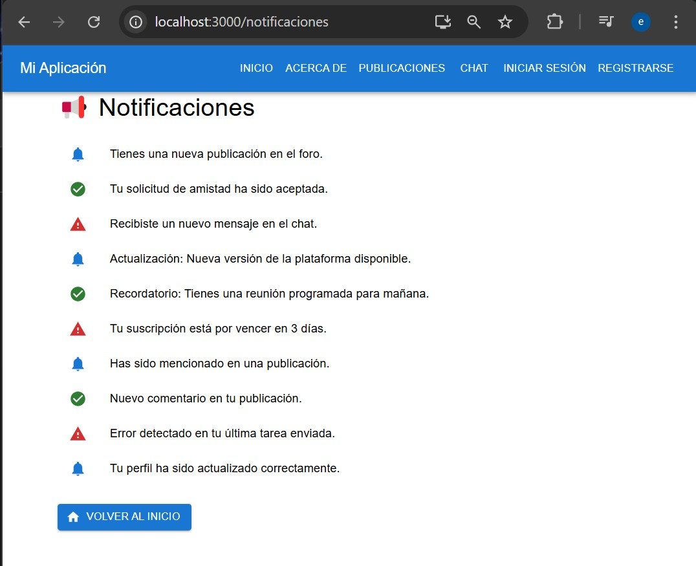
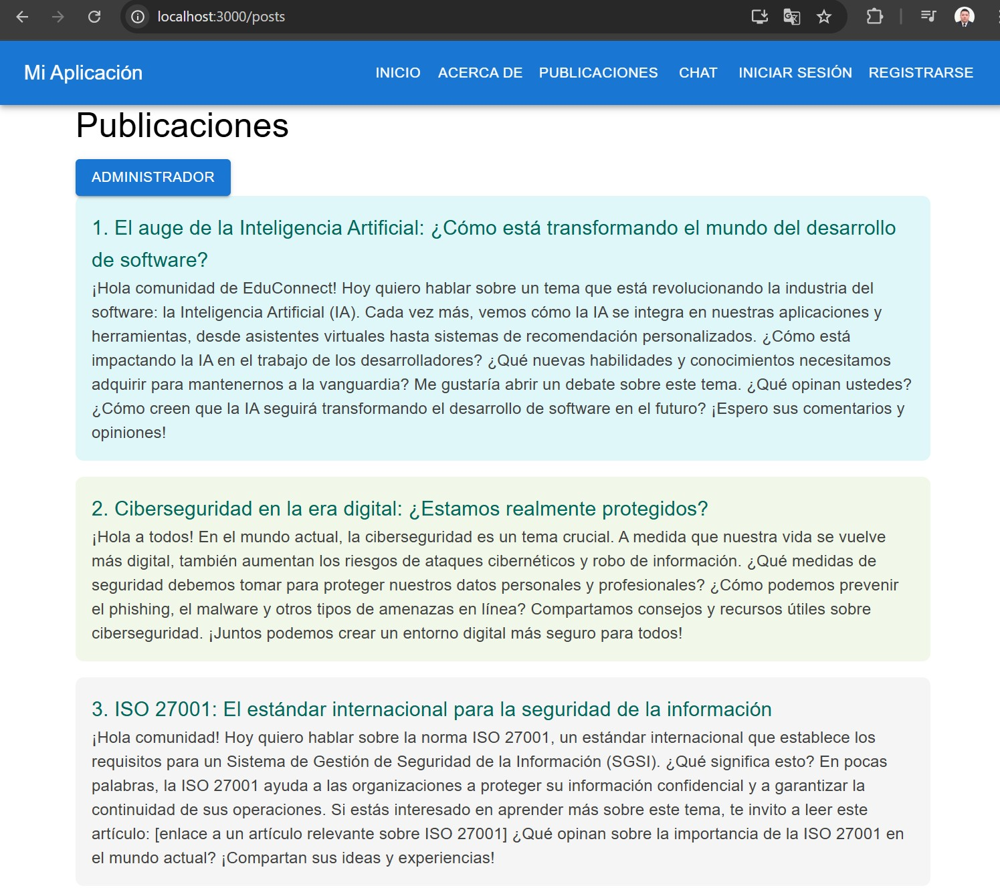

# ESPE

## Estudiante 
### Edison Nicolas Guamialama Haro 

## Docente 
### Ing. Angel Codco


## Actividad de aprendizaje n.° 2

# EduConnect

EduConnect es una aplicación web desarrollada con **React** y **TypeScript** que permite gestionar la educación de manera eficiente, proporcionando herramientas para estudiantes, profesores y administradores.  

## 📌 Características

- Gestión de usuarios (estudiantes, profesores, administradores).  
- Interfaz moderna y accesible.  
- Soporte para formularios y validación de datos.  
- Implementación de buenas prácticas con TypeScript.  

## 📋 Requisitos Previos

Antes de instalar el proyecto, nos asegúramos de tener los siguientes requisitos en nuestro sistema:  

- [Node.js](https://nodejs.org/) (versión 16 o superior)  
- [npm](https://www.npmjs.com/) o [yarn](https://yarnpkg.com/)  
- Un editor de código como [VS Code](https://code.visualstudio.com/)  

## 🔧 Instalación

Sigue estos pasos para configurar y ejecutar el proyecto en tu máquina local:

1. **Clona el repositorio:**  

   ```sh
   git clone https://github.com/ENiko-Gh/-educonnect.git
   cd educonnect
Instala las dependencias:

npm install
Inicia el servidor de desarrollo:

npm start
Accede a la aplicación:

Abre tu navegador en http://localhost:3000

🚀 Construcción y Despliegue
Para generar una versión optimizada del proyecto, ejecutamos:

npm run build
Esto generará una carpeta build/ lista para producción.

❓ Solución de Problemas
Si tienes problemas con dependencias o paquetes, intenta los siguientes comandos:

rm -rf node_modules package-lock.json
npm install
Si el problema persiste, revisa la documentación oficial de React y TypeScript.

🛠 Tecnologías Utilizadas
React 19.0
TypeScript 5.7
React Router para navegación
CSS Modules / Tailwind CSS para estilos


### DESARROLLO  Y VISUALIZACION DEL PROYECTO "EDUCONNECT"


luego del detalle de la instalacion  prosedemos a implementar las carpetas  en funcion de una estructura  previamente analizada

Esta apliccion cuenta en el header con un menu de navegacion consta de inicio , Acerca de, Publicaciones, Chat, iniciar secion
registrarce 

en la pagina de inicio


contiene un sistema da notificacion  que cuando existe alguna noticiacin  externa o intenrna al sistema 
se visualiza  (Iienes un nuevo mensaje ) en el mismo espacio de visualizacion  se visualiza el mensaje de 
publicaciones realizada  dispone de un enlace a las notificaciones   y otro  que podemos Eliminar   o limpiar las notificaciones 




mensaje de bienveida  con una pequeña descripcion y la invitacion a formar parte de nuestro sistema 
al dar click en "VER PUBLICACIONES" redirige a las publicaciones  


